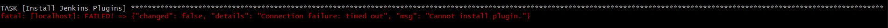
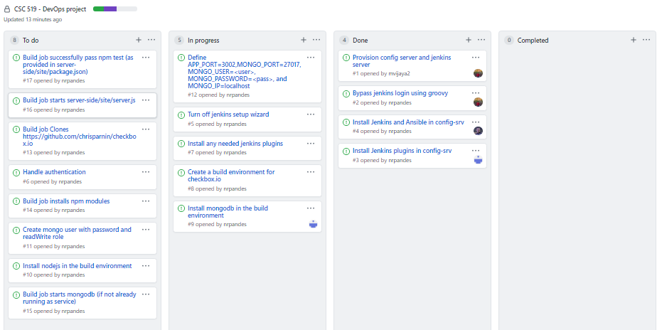

# Checkpoint Report of Team 20

Following general tasks are being performed as part of checkpoint 1

## Automatically configure a jenkins server - Sharath

Tasks Completed:

- Wrote Ansible scripts to install jenkins, suggested plugins and bypassing user authentication using groovy script on the build server

Tasks for next checkpoint:

- Turning off jenkins setup wizard

- Configure server to trigger build jobs for checkbox.io

## Automatically configure a build environment (checkbox.io) - Niranjan

Tasks Completed:

- Wrote and tested ansible script to install mongodb on config-srv

Tasks for next checkpoint:

- Create a build environment for checkbox.io

- Create mongo user with password and readWrite role

- Define APP_PORT=3002,MONGO_PORT=27017, MONGO_USER=<user>, MONGO_PASSWORD=<pass>, and MONGO_IP=localhost

## Create a build job for jenkins - Mangalnathan

Tasks Completed:

- Extended setup.js to install ansible on spawned build server and run the ansible scripts to install jenkins, nodejs, npm, mongodb and java.

Tasks for next checkpoint:

- Build job clones https://github.com/chrisparnin/checkbox.io

- Build job installs npm modules

- Start mongodb (if not already running as service)

- Start server-side/site/server.js

- Successfully pass npm test (as provided in server-side/site/package.json)

## Known issues:

While installing one of the plugin through build-pipeline-plugin, we are getting timeout issues. It runs successfully when the install is executed for the second time.

We tried rectifying it with the suggested [link](https://stackoverflow.com/questions/42219781/gets-error-cannot-get-csrf-when-trying-to-install-jenkins-plugin-using-ansible/42224672#42224672)

We will try to address this issue in the next checkpoint.

## Project Board

View project board [here](https://github.ncsu.edu/cscdevops-spring2021/DEVOPS-20/projects/1)

